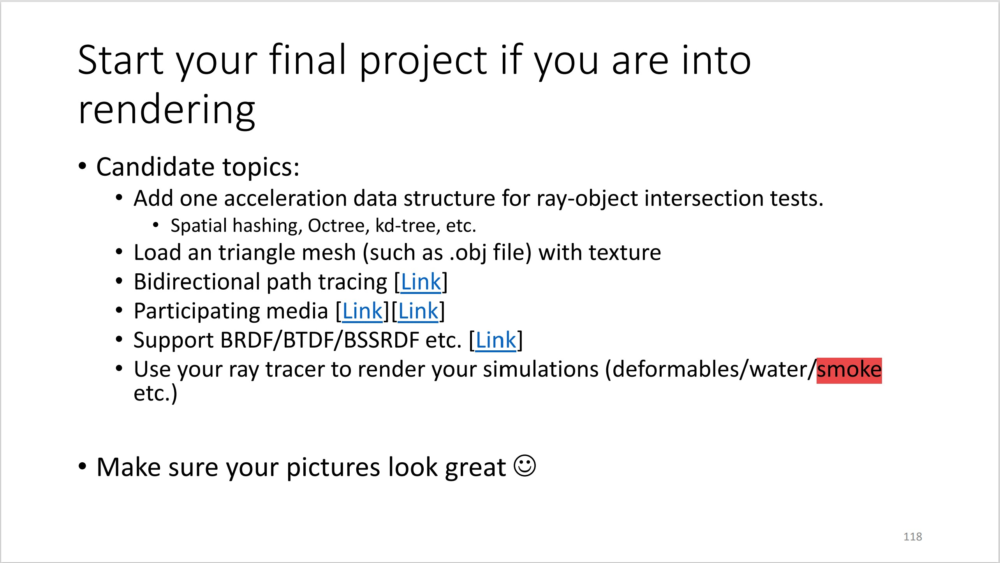
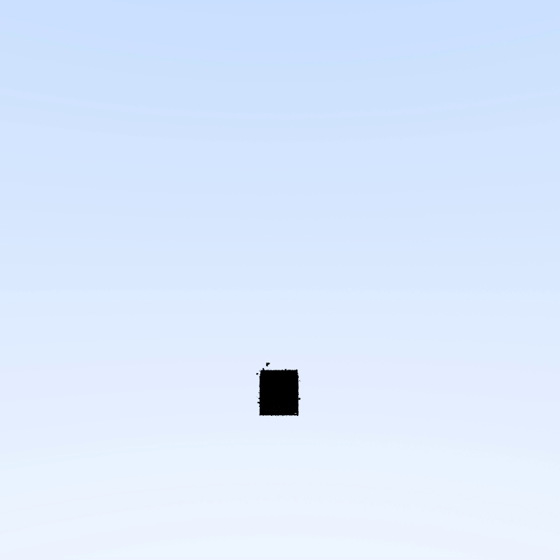
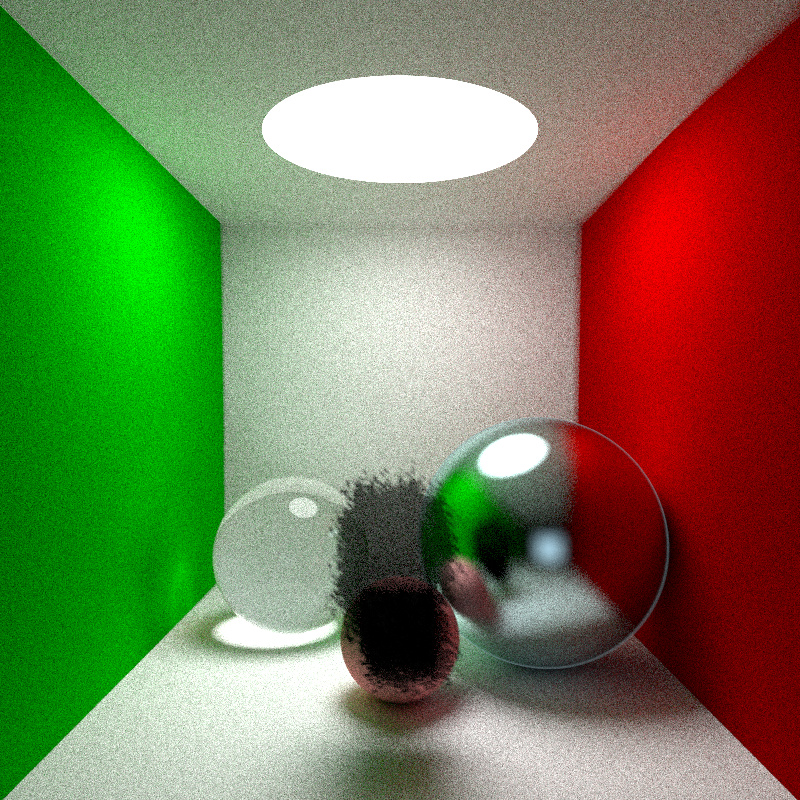
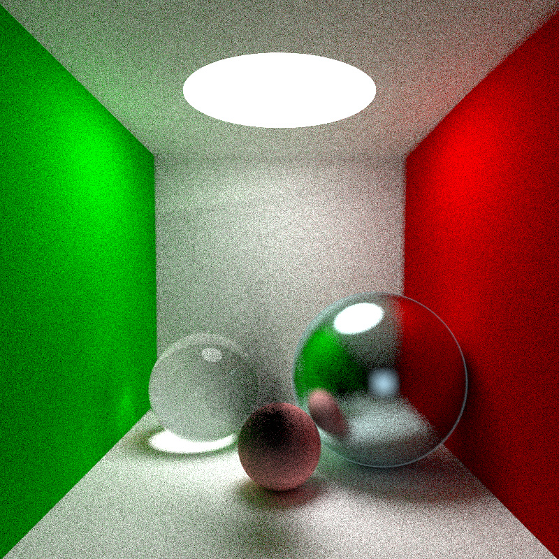

# 太极图形课S1-大作业-烟雾仿真和渲染

## 作业来源
> 灵感来源于

其实也是我提交了的两次小作业[又一个Taichi语言的Ray Tracer](https://github.com/0xrabbyte/TinyRayTracer-Taichi)(顺便一提我后来又更新了这个项目,添加了上面那张slide中的前两项及其他一些东西,虽然考虑到效率问题这个项目还是用了最初版的代码)和[最简单的流体仿真](https://github.com/0xrabbyte/taichi_simple_fluid_solver)的结合体

## 运行方式

#### 运行环境：
`[Taichi] version 0.8.8, llvm 10.0.0, commit 7bae9c77, win, python 3.7.8`

#### 运行：
直接运行`renderer.py`进行渲染

点击窗口来切换视点

j,k键调整水平视角

上下左右键调整视点

s键截图

r键开启/终止录制

f键终止/开始烟雾仿真

## 效果展示
只进行烟雾仿真是实时的(可以看到人为设定的边界)

在Cornell Box中进行烟雾仿真




## 整体结构
```
-LICENSE
-|img
-README.MD
-renderer.py   渲染部分,程序入口
-fluid_3d.py   仿真部分
-requirements.txt
```

## 实现细节：
### 仿真部分：
采用MacCormack方法进行advect,并进行clipping

Project部分暴力的采用了jacobi方法

在每个仿真步的开始对固定区域添加颗粒,并以一定概率对每个grid的速度进行随机的改变
### 渲染部分：
进行Path Tracing,并暴力地判断是否于物体相交。对存在烟雾仿真地部分套上一个包围盒。如果能与包围盒相交则在其中进行Ray Marching,出射的概率取决于当前格的密度。

## TODO(考试周写不动了)
- 使用Animation and Rendering of Complex Water Surfaces一文中的方法建立Level set并进行水的仿真
- 使用GPU Gems 03,Chapter 30. Real-Time Simulation and Rendering of 3D Fluids中提到的方法实现固液耦合
- 更精心地处理边界
- 更精心地使用Ray Marching 渲染烟雾
- 交互式的添加烟雾

## 还存在的问题
- 粗糙的边界处理使得烟雾会消散

## 参考
太极图形课S1[第6讲](https://b23.tv/BV1AT4y1d762)和[第11讲](https://b23.tv/BV1934y1X7MD)

[GAMES201 Lecture 04](https://b23.tv/BV1ZK411H7Hc?p=4)

[try volumetric ](https://www.shadertoy.com/view/Xsd3R2)